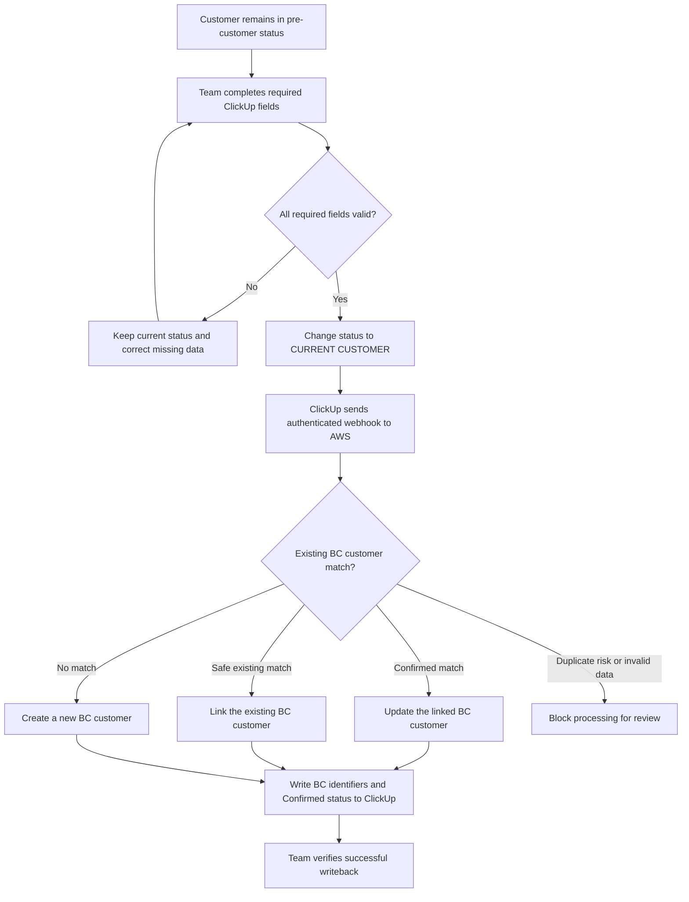

# ClickUp to Business Central Customer Setup

## Purpose

Use this process when a qualified ClickUp customer is ready to become a Business Central customer.

The customer record is sent to Business Central only when the ClickUp task changes to `CURRENT CUSTOMER`. Complete and verify every required field **before** changing the status.

## Process owner checklist

1. Keep the task in its current pre-customer status while collecting the customer data.
2. Complete all fields in the **Required team-entered fields** table.
3. Complete the conditional credit field when the customer has credit terms.
4. Review the legal name, tax ID, country, and credit information against the customer's official documentation.
5. Only after the record passes the checklist, change the task status to `CURRENT CUSTOMER`.
6. Wait for the AWS automation to process the task.
7. Confirm that all four system-managed BC fields were populated.
8. If confirmation does not appear, do not create the customer manually and do not clear any BC identifiers. Follow the exception process below.

## Required team-entered fields

| ClickUp custom field | What the team must enter | Validation and integration use |
| --- | --- | --- |
| `Owner Country/` | Select exactly `Guatemala` or `Mexico`. | Routes the customer to the correct BC company: `Guatemala` becomes `GT`; `Mexico` becomes `MX`. Any other or blank value blocks the sync. |
| `Business Central Legal Name` | Customer's official invoicing/legal name, preferably in uppercase. | Becomes the BC customer display name and invoicing legal name. Do not use only a commercial nickname. |
| `Customer Tax ID` | Official tax number, preferably digits only. | Primary tax field and strongest duplicate-control value. If this field is unavailable or blank, `Tax ID` is accepted as the fallback. Never enter different values in the two fields. |
| `Contact E-mail 1` | Primary email that should receive customer invoices. | Canonical email field. If that exact field is unavailable, `Contact Email 1` is accepted. The bridge can fall back to `Operations Email`, `Sales email`, or `Finance email`, but the team should use the primary contact field to avoid ambiguity. |
| `Contact Phone 1` | Primary customer telephone, including country code. | Canonical telephone field. A secondary phone can technically be used as a fallback, but the primary field should be completed. |
| `Customer Address` | Complete, usable customer address from the mapped/location field. | Becomes the BC address. Do not enter a partial or invented address. |
| `Credit Days Required` | Enter `0` for cash/immediate payment, or the approved number of credit days. | `0` becomes BC terms `CONTADO` and payment method `CONTADO`. A positive number becomes `<number> DÍAS` and payment method `CREDITO`. The corresponding payment term must exist in BC. If the list uses `Credit Terms` instead, that field is accepted. |

All seven required data points must be present before the task moves to `CURRENT CUSTOMER`.

## Conditional and recommended fields

| ClickUp custom field | When to complete it | Integration use |
| --- | --- | --- |
| `Credit amount approved` / `Credit Approved` | Required by the business process whenever the customer receives credit. Enter a numeric amount only. Use `0` for no approved credit limit when appropriate. | Sets the BC credit limit. The current field ID used by the bridge is `54574add-833f-42a5-b027-3b0d64ef95af`. |
| `Contact Name 1` | Complete whenever a primary contact is known. | Writes the contact name to the BC invoicing extension. |
| `Webpage` | Complete when the customer has an official website. | Writes the website to BC and helps the duplicate matcher. |
| `Clientes/` | Select the correct customer reference when available. | Helps customer matching and traceability. It does not replace `Business Central Legal Name`. |
| `The customer Needs credit?` | Maintain for the team's commercial workflow if used. | Informational only; it does not determine BC payment terms or credit limit. `Credit Days Required` and the approved amount fields control the integration. |

## Status and automation flow

## Successful writeback: fields the system manages

The AWS integration populates these fields. Team members must not type into, replace, or clear them:

| ClickUp custom field | Expected result |
| --- | --- |
| `Business Central Customer Number` | BC number such as `C00118`. |
| `Business Central Customer ID` | BC internal record ID. |
| `Business Central Customer Link` | Clickable link to the customer in the correct BC company. |
| `BC Match Status` | Must resolve to `Confirmed` after successful processing. |

A customer is fully synchronized only when the BC customer number, ID, link, and `Confirmed` match status are present.

`Business Central Legal Name` is different: the team must complete it before the first sync, and the integration writes the confirmed BC display name back into the same field. If the legal name later changes officially, correct this source field and use the exception/retry process so BC is updated safely.

## Pre-trigger quality check

Before changing the status, confirm all of the following:

- [ ] `Owner Country/` is `Guatemala` or `Mexico`.
- [ ] `Business Central Legal Name` matches official tax/invoicing documentation.
- [ ] `Customer Tax ID` or fallback `Tax ID` is correct and contains the same tax identity used in BC.
- [ ] A valid primary customer email is present.
- [ ] A valid primary customer phone is present.
- [ ] `Customer Address` is complete.
- [ ] `Credit Days Required` or `Credit Terms` is present and approved.
- [ ] If credit applies, the approved numeric credit amount is present.
- [ ] The system-managed BC fields have not been manually populated with guessed values.
- [ ] The task is ready to be changed to `CURRENT CUSTOMER` only once.

## Credit examples

| ClickUp value | BC payment terms | BC payment method |
| --- | --- | --- |
| `0` or `CONTADO` | `CONTADO` / immediate payment | `CONTADO` |
| `7` | `7 DÍAS` | `CREDITO` |
| `15` | `15 DÍAS` | `CREDITO` |
| `30` | `30 DÍAS` | `CREDITO` |

Use only terms approved by Finance and configured in the applicable BC company.

## Exception and retry process

If the task is already `CURRENT CUSTOMER` and the required fields are later corrected, editing the fields alone does **not** retrigger the status-change automation.

1. Do not clear `Business Central Customer Number`, `Business Central Customer ID`, `Business Central Customer Link`, or `BC Match Status`.
2. Do not create the customer manually in BC; this can produce duplicates.
3. Capture the ClickUp task link and the fields that were corrected.
4. Ask the integration owner to replay the AWS customer sync for that task.
5. After replay, verify the four system-managed fields and open the BC link to confirm the record.

If the integration reports a possible duplicate or writes a status other than `Confirmed`, stop and have the integration owner compare the ClickUp tax ID and legal name against the candidate BC customer before retrying.

## Short team instruction

> Complete Owner Country/, Business Central Legal Name, Customer Tax ID, Contact E-mail 1, Contact Phone 1, Customer Address, and Credit Days Required before changing the task to CURRENT CUSTOMER. If credit applies, also enter the approved credit amount. After the status change, confirm that the BC customer number, ID, link, and BC Match Status = Confirmed were written back. Never manually edit or clear the BC system fields.
